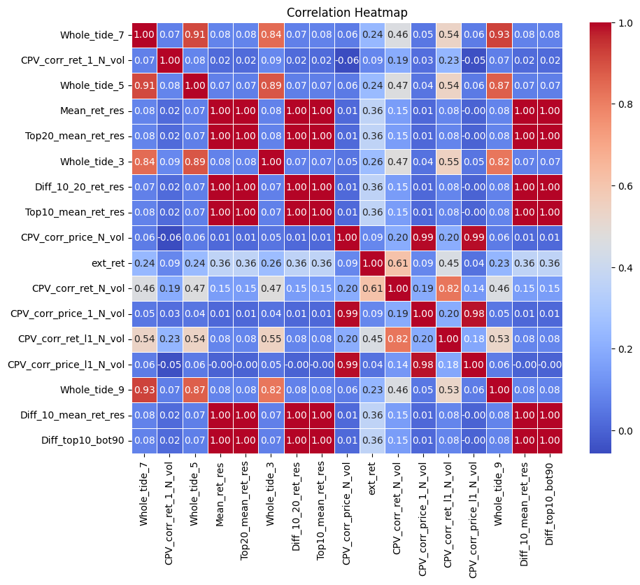

# MFE5210 Assignment
Author： 王赫男 WangHenan 224040167

本次作业的标的选择为中国**商品期货和金融期货**（包含55个品种），利用**高频数据低频化**的方式基于1min频率的数据拟合日频因子，预测Open-to-Open收益率。本文一共构建了**17个因子**，一共可分为**4大类**，最后参考2014至2021年样本内的表现（IC、ICIR分析及因子回测）以及相关性筛选标准，选择出**5个因子**进行样本外测试，全品种因子等权组合**2022年样本外夏普1.27**，表现尚可。

## 文件说明

- /合约数据 ： 保存着每个品种历史上主力合约的1min数据
- /Factor_csv ： 保存着因子文件，每一个因子文件中index为日期，column为品种代码，values是因子值
- Return_Data.xlsx ： 保存每个品种的主力合约的收益率数据
- Factor_Calculate.ipynb ： 因子计算代码
- Single_Factor_Test.py ： 因子测试所需要的class和相关function
- Factor_Evaluate.ipynb ：因子评价，主要是IC分析和全品种的因子回测
- Factor_OOS.ipynb ： 因子筛选以及样本外测试

## 因子构建

因子构建部分，主要参考了一些券商金工的研报，分别计算了**量价相关性类因子、成交量潮汐因子、成交量激增时段的跳跃因子、极端收益因子**，因子的构建均采用**日内1min频率的数据降频至日频**的方式。

具体的因子计算方式详见Factor_Calculate.ipynb。

## 因子评价

因子评价部分主要采用两部分：RankIC、RankIC_IR分析和全品种因子回测。

这里面采用全品种因子回测而不是分层回测的原因是，商品期货的品种数量较少，分层回测带来的偶然性和误差较大，其次由于商品期货可以做空的特性，我们则直接将**因子视为仓位比例，若因子为正则做多，因子为负则做空**，进行全品种的因子回测，最后分析逐年的夏普、最大回撤、卡玛比率、峰度偏度等。

具体的因子表现详见Factor_Evaluate.ipynb。

## 因子筛选

全部17个因子的相关性如下：

经过相关性筛选以及样本内表现，我们选择以下5个因子：

CPV_corr_ret_1_N_vol、CPV_corr_ret_N_vol、Whole_tide_3、Diff_10_20_ret_res、ext_ret

这五个因子的相关性如下：

## 样本外测试

上述5个因子在样本外我们一共尝试了3种组合方式，每一种的样本外夏普都大于1.2：

### 等权

### RankIC加权

### RankIC_IR加权

